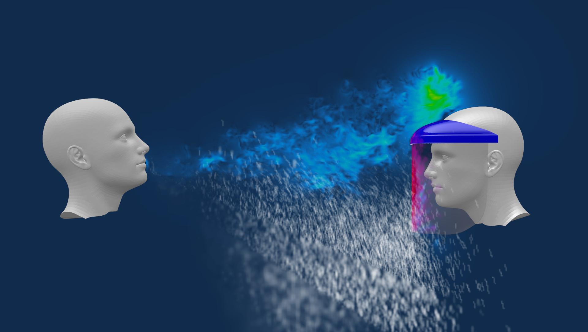

[Link to (this) Webpage](https://cal-cs184-student.github.io/sp22-project-webpages-KeWang0622/final_project/index.html)

[//]: # ([Link to Code]&#40;https://github.com/cal-cs184-student/p1-rasterizer-sp22-mr_graphics&#41;)

## Project Summary

Since the first case of COVID-19 was confirmed in 2019, the pandemic has become one of the biggest concerns for the people around the world.
In order to better understanding and visualizing the transmission of COVID-19, in this project, we will be implementing a realistic 3D Covid-19 particle and airflow simulations based on physics modeling.
Furthermore, we aim to simulate how masks/shields can prevent the particles/droplets from spreading out and evaluate our simulations on realistic scenes (e.g., closed spaces with or without ventilation, airplanes).

  

  Image from the internet

### Team members

* Alfredo De Goyeneche `asdegoyeneche@berkeley.edu` CS 284
* Ke Wang `kewang@berkeley.edu` CS284
* Catherine Gai `catherine_gai@berkeley.edu` CS184
* Wenhan Sun `wenhan0112@berkeley.edu` CS184

## Problem Description
COVID-19 disease have posed unprecedented challenges to the entire world. Up to April 2022, around 500 million people were reported to be infected. In order to better understanding and visualizing the transmission of COVID-19, in this project, we will be implementing a realistic 3D COVID-19 particle and airflow simulation based on physics modeling.

It's well understood that COVID-19 is transmitted mainly through close contact and respiratory droplets. Therefore, we aim to investigate how the virus spreads through particles and droplets. We will use the realistic data and parameters (droplet size, ariflow speed, etc.) for our simulations. Specifically, our goals can be summarized as follows:

1. Simulating the transmission of particles/droplets during the phases of inhalation and exhalation using fluid dynamics.
2. Simulating how masks/shields can prevent the particles/droplets from spreading out during the phases of inhalation and exhalation.
3. Simulating and evaluating the COVID particle transmission in realistic scenes (e.g., closed space, airplane with/without active air circulation).

## Goals and Deliverables

The theoretical part of our project will be based mainly on Navier-Stokes equation. We will approach the solutions of this partial differential equation under different boundary conditions, and render the results on the screen. The results will be animations of movement of particles as well as instantaneous distribution of particles around the scene. Concrete breakdowns are as follows:

### First step: particle simulator

The first set of conditions are fairly simple. We will start with a cloud of static particles in space and simulate their movements for a period of time. The particles will have zero initial velocity and there will be no constraints in space of their movements.

### Second step: exhalation/ coughing simulator

Next we will impose initial velocity to each particle in the cloud. To simulate exhalation, we plan to sample a direction from a range of solid angles for each particle, while its velocity can be sampled within a small range (the initial velocity of exhaled particles should not vary too much). We then solve the PDE under these initial conditions. Simulating coughing would be similar to exhalation, but with a different solid angle range, higher velocity, and higher randomness/turbulence. We hope to see a significant difference in the propagation distance produced by exhalation and coughing.

### Third step: effect of masks or other facial coverings

Our third step will be imposing more constraints during particle transmission. In particular, we want to explore the effect of masks and other facial coverings on the spread of particles. To simulate a facial covering, we plan to define a surface within a certain distance from the particle source that holds probability  to let through the particle, and probability  of blocking it. The blocked particles will either bounce back, or get trapped (velocity zero) and would not be taken into account during simulation in later steps. We will simulate different types of masks with different "passing-parameter" . In this part, we expect to see that facial coverings can effectively reduce the spread of exhaled particles.

### More to Explore

If time allows, our team hopes to simulate transmission in more realistic settings. For example, we can impose more constraints on the velocity and direction of air flow (boundary conditions) to inspect droplet transmission under different ventilations. Hopefully we can further deduce that proper ventilation can help alleviate the spread of COVID-19-related particles. We can also simulate a more realistic way of interaction between particles and surfaces by retaining a non-zero velocity of the particle as they reach the surface. 

## Schedule

We have about two weeks until the first milestone is due, three weeks until the final presentation, and about four weeks from today until the final paper and video are due. We are planning to tackle our goals as follows:

### Week 1: April 12th to April 19th

* Get initial particle simulation from our first step running properly. Allow to customize particle properties. Similar to smoke simulator of previous years. 
* Start simulating air sources (exhalation / coughing) with initial velocity different than zero. This requires customizing the environment to probably include a person or a simplified person placeholder to place the air source at. 

### Week 2: April 19th to April 26th

* Finish simulating air sources.
* Incorporate mask(s) with customizable properties.
* Compare simulations of masks vs no mask.
* Milestone report due April 26th.

### Week 3: April 26th to May 3rd

* Incorporate feedback from milestone submission.
* Finish implementing and analyzing multiple masks geometries and properties (e.g. try to simulate surgical vs cloth vs KN95 masks, loosely fitted mask, or only over-mouth mask).
* For every setup (different mask, distance from source, etc) analyze effectiveness by comparing the average percentage of particles that arrive to point of interest, relative to initial count of particles and also relative some baseline (e.g. no mask and 1 feet away).
* If time allows, implement more realistic settings such as including ventilation settings, simulating open air setting with potentially some wind, etc. Here, also analyze effectiveness/risk.
* Start preparing presentation.

### Week 4: May 3rd to May 10th

* No more coding, just running last experiments for presentation and final report.
* Finish preparing presentation, due May 5th.
* Incorporate feedback from final presentation.
* Write final paper and record final video.

## Resources

Some resources regarding that will help us understand Covid-19 properties and masks properties:

* [Covid-19 Particle and Airflow Simulations](https://awards.journalists.org/entries/covid-19-particle-and-airflow-simulations/)
* [Modelling aerosol transport and virus exposure with numerical simulations in relation to SARS-CoV-2 transmission by inhalation indoors](https://www.sciencedirect.com/science/article/pii/S0925753520302630)
* [CFD Simulation of the Airborne Transmission of COVID-19 Vectors Emitted during Respiratory Mechanisms: Revisiting the Concept of Safe Distance](https://pubs.acs.org/doi/10.1021/acsomega.1c01489)

Resources for simulation of particle dynamics:

* [Fluid Simulation SIGGRAPH 2007 Course Notes](https://www.cs.ubc.ca/~rbridson/fluidsimulation/fluids_notes.pdf)
* [GPU Gems Chapter 38: Fast Fluid Dynamics Simulation on the GPU, By Mark J. Harris](https://developer.nvidia.com/gpugems/gpugems/part-vi-beyond-triangles/chapter-38-fast-fluid-dynamics-simulation-gpu)
* [Real-Time Fluid Dynamics for Games, by Jos Stam](https://www.dgp.toronto.edu/public_user/stam/reality/Research/pdf/GDC03.pdf)
* [Stable Fluids, by Jos Stam](https://www.dgp.toronto.edu/public_user/stam/reality/Research/pdf/ns.pdf)

Other resources: 

* We will probably use [OpenGL](http://www.opengl-tutorial.org/).
* We might reference previous years related projects in smoke and fluid simulation, if allowed:
  * [Smoke Simulator by Rachel Bhadra, Jonathan Ngan, Kenneth Tsai, 2018](https://rachelbhadra.github.io/smoke_simulator/)
  * [Smoke Simulation by Eric Ying, Yuanhao Zhai, Fangzhou Lan
, 2019](https://github.com/SKYSCRAPERS1999/CS184-Smoke-Simulation)
  * [Position Based Fluids by Cheng Chen, Mingfang Zhang, Zhiming Xu, 2019](https://github.com/zhiming-xu/fluid-sim)
  